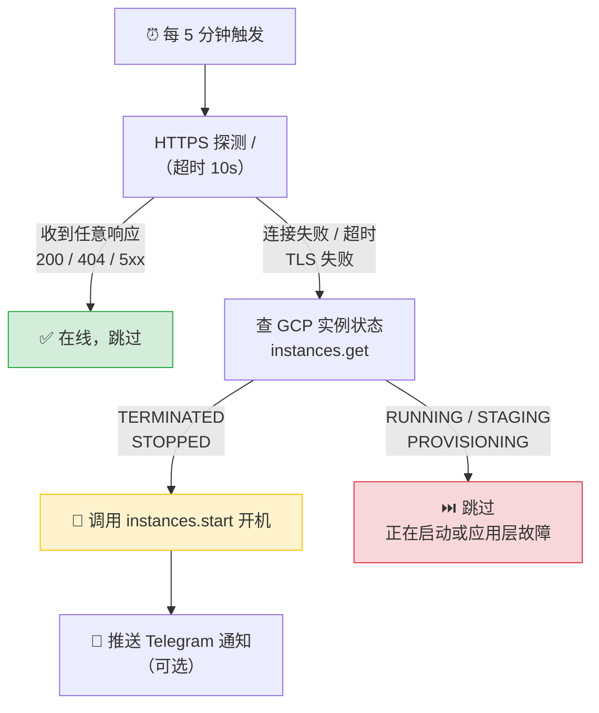

# GCP Spot Watchdog

> 自动监控 GCP Spot 实例，被抢占关机后秒级感知、自动拉起，并通过 Telegram 推送通知。

[](LICENSE)
[](#)
[](#)

[English](README_EN.md)

---

## 为什么需要它？

GCP **Spot（抢占式）实例**价格低至按需的 60-91% 折扣，但随时可能被 GCP 回收关机。对于可以容忍短暂中断的工作负载，Spot 是极具性价比的选择——只要有办法在被抢占后**快速自动重启**。

**GCP Spot Watchdog** 就是这个"自动重启器"。

## 工作原理



**关键设计**：不是"探测失败就开机"——而是以 GCP 实例状态作为**闸门**，只有确认实例确实处于 `TERMINATED`/`STOPPED` 状态才下发 `start`。这避免了对正在启动的实例重复下发指令，也能区分"被抢占关机"和"服务自身挂了但 VM 还在跑"。

## 两套部署方案

提供两套**完全独立**的方案，按需选一套部署：

| | 方案 A：Debian Watchdog | 方案 B：Cloudflare Worker |
|:--|:--|:--|
| **运行环境** | 一台常在线的 Linux 机器 | Cloudflare 无服务器 |
| **技术栈** | Bash + gcloud CLI + systemd timer | JavaScript + Cron Trigger |
| **探测方式** | `curl` | `fetch()` |
| **GCP 鉴权** | `gcloud` 服务账号激活 | JS 手签 RS256 JWT → OAuth token |
| **需要常在线机器** | 是 | **否** |
| **适合场景** | 已有常驻服务器 / 内网探测 | 不想额外维护机器 / 免费方案 |

## 快速开始

### 前置要求

- 一个 GCP 项目，其中有 Spot 实例在运行
- 被监控实例有**公网可达的 HTTPS 服务**（端口已在防火墙放行）
- 已安装 [gcloud CLI](https://cloud.google.com/sdk/docs/install) 并登录了有 IAM 管理权限的账号

### 第 1 步：GCP 服务账号准备（两套共用）

`setup-gcp.sh` 会创建一个最小权限的服务账号（仅 `compute.instances.get` / `start` / `list`），并下载密钥文件。

> **💡 推荐使用 GCP Cloud Shell**
>
> 打开 [GCP 控制台](https://console.cloud.google.com)，点击右上角的 **`>_`** 图标即可启动 Cloud Shell。
> 它自带 `gcloud` 且已登录你的账号，无需本地安装任何工具。跑完后用 `cloudshell download sa-key.json` 把密钥下载到本地。

<details>
<summary>在 Cloud Shell 中操作</summary>

```bash
# 1. 上传脚本（或直接在 Cloud Shell 编辑器里粘贴内容）
#    也可以把仓库 clone 下来：
git clone https://github.com/ahdiua/GCP-Spot-Watchdog.git
cd GCP-Spot-Watchdog

# 2. 编辑 PROJECT_ID
nano setup-gcp.sh

# 3. 运行
bash setup-gcp.sh

# 4. 下载密钥到本地
cloudshell download sa-key.json
```

</details>

<details>
<summary>在本地终端操作</summary>

```bash
# 需要先安装 gcloud CLI 并登录：
# https://cloud.google.com/sdk/docs/install
gcloud auth login

git clone https://github.com/ahdiua/GCP-Spot-Watchdog.git
cd GCP-Spot-Watchdog

# 编辑脚本顶部的 PROJECT_ID
nano setup-gcp.sh         # 或 vim / code

bash setup-gcp.sh
```

</details>

运行完成后会生成 `sa-key.json`，并打印服务账号邮箱。**请妥善保管此文件，不要提交到 git。**

---

### 第 2 步（方案 A）：Debian Watchdog 部署

> 适用于你已有一台常在线的 Debian/Ubuntu 机器。

#### 2A-1. 安装依赖

```bash
sudo apt-get update && sudo apt-get install -y curl

# 安装 gcloud CLI（按官方指引）：
# https://cloud.google.com/sdk/docs/install#deb
```

#### 2A-2. 配置目标实例

编辑 `spot-watchdog/targets.conf`，每行一台实例：

```conf
# project            zone              instance      health_url
my-project           us-central1-a     web-1         https://web1.example.com/
my-project           asia-east1-b      worker-1      https://worker1.example.com/
```

> `health_url` 只要能连上并返回**任意 HTTP 响应**（200/404/500 都算）即视为在线。

#### 2A-3. 安装到系统

```bash
sudo mkdir -p /opt/spot-watchdog
sudo cp spot-watchdog/watchdog.sh spot-watchdog/targets.conf sa-key.json /opt/spot-watchdog/
sudo chmod 600 /opt/spot-watchdog/sa-key.json
sudo chmod +x /opt/spot-watchdog/watchdog.sh
sudo cp spot-watchdog/spot-watchdog.service spot-watchdog/spot-watchdog.timer /etc/systemd/system/
sudo systemctl daemon-reload
sudo systemctl enable --now spot-watchdog.timer
```

#### 2A-4.（可选）启用 Telegram 通知

编辑 `/etc/systemd/system/spot-watchdog.service`，取消注释并填写：

```ini
Environment=TG_BOT_TOKEN=你的bot_token
Environment=TG_CHAT_ID=你的chat_id
```

然后重载：

```bash
sudo systemctl daemon-reload
```

#### 2A-5. 验证

```bash
# 手动触发一次
sudo systemctl start spot-watchdog.service

# 查看日志
journalctl -u spot-watchdog.service -f

# 查看下次触发时间
systemctl list-timers spot-watchdog.timer
```

<details>
<summary>可覆盖的环境变量</summary>

| 变量 | 默认值 | 说明 |
|:--|:--|:--|
| `GCP_SA_KEY` | `<脚本目录>/sa-key.json` | 服务账号密钥路径 |
| `WATCHDOG_CONF` | `<脚本目录>/targets.conf` | 目标清单路径 |
| `PROBE_TIMEOUT` | `10` | HTTP 探测超时（秒） |
| `TG_BOT_TOKEN` | — | Telegram bot token |
| `TG_CHAT_ID` | — | Telegram chat id |

</details>

---

### 第 2 步（方案 B）：Cloudflare Worker 部署

> 无需常在线机器。免费额度即可覆盖。

#### 2B-1. 安装依赖并登录

```bash
cd spot-watchdog-worker
npm install
npx wrangler login    # 浏览器弹出 Cloudflare 授权页面
```

#### 2B-2. 配置目标实例

编辑 `wrangler.toml` 里的 `TARGETS`：

```toml
TARGETS = '''[
  {"project":"my-project","zone":"us-central1-a","instance":"web-1","healthUrl":"https://web1.example.com/"},
  {"project":"my-project","zone":"asia-east1-b","instance":"worker-1","healthUrl":"https://worker1.example.com/"}
]'''
```

#### 2B-3. 设置 Secrets

```bash
# 服务账号邮箱（setup-gcp.sh 运行后打印的）
npx wrangler secret put GCP_SA_EMAIL

# 服务账号私钥（从 sa-key.json 提取）
npx wrangler secret put GCP_SA_PRIVATE_KEY
```

> **PowerShell 提取私钥**：`(Get-Content sa-key.json | ConvertFrom-Json).private_key`
>
> **Bash/Linux 提取**：`jq -r .private_key sa-key.json`

#### 2B-4.（可选）启用 Telegram 通知

```bash
npx wrangler secret put TG_BOT_TOKEN
npx wrangler secret put TG_CHAT_ID
```

#### 2B-5. 部署

```bash
npx wrangler deploy
```

Cron Trigger 会每 5 分钟自动执行。

#### 2B-6. 验证

```bash
# 本地开发测试
npx wrangler dev
# 另开终端触发一轮
curl http://localhost:8787/run

# 查看线上实时日志
npx wrangler tail
```

<details>
<summary>环境变量 / Secrets 一览</summary>

| 名称 | 类型 | 说明 |
|:--|:--|:--|
| `TARGETS` | var | 目标实例 JSON 数组 |
| `PROBE_TIMEOUT_MS` | var | HTTP 探测超时毫秒（默认 10000） |
| `GCP_SA_EMAIL` | secret | 服务账号邮箱 |
| `GCP_SA_PRIVATE_KEY` | secret | 服务账号私钥 PEM |
| `TG_BOT_TOKEN` | secret | Telegram bot token（可选） |
| `TG_CHAT_ID` | secret | Telegram chat id（可选） |

</details>

---

## Telegram 通知

两套方案均支持可选的 Telegram 推送。设置 bot token 和 chat id 后，以下事件会触发通知：

| 事件 | 消息示例 |
|:--|:--|
| 实例自动开机成功 | `🔴→🟢 Spot 实例已自动开机` + 实例名/项目/区域/时间 |
| 实例开机失败 | `❗ Spot 实例开机失败` + 实例名/项目/区域/时间 |

**获取 Telegram Bot Token 和 Chat ID**：

1. 在 Telegram 搜索 **@BotFather** → 发送 `/newbot` → 按提示创建，拿到 bot token
2. 给你的新 bot 随便发一条消息
3. 访问 `https://api.telegram.org/bot<你的token>/getUpdates`，从返回的 JSON 中找到 `chat.id`
4. 或者直接搜索 **@userinfobot** 获取你的 chat id

## 端到端测试

故意停掉一台实例来验证自动拉起：

```bash
# 1. 手动停掉测试实例（模拟被抢占）
gcloud compute instances stop TEST_INSTANCE --zone=ZONE

# 2. 手动触发一轮（或等 5 分钟自动触发）
#    方案 A：
sudo systemctl start spot-watchdog.service
#    方案 B（本地）：
curl http://localhost:8787/run

# 3. 期望结果：
#    - 日志输出 DOWN → START ... TERMINATED -> 开机
#    - GCP 控制台实例状态从 TERMINATED 变为 STAGING → RUNNING
#    - （如已配置）Telegram 收到开机通知
```

## 项目结构

```
GCP-Spot-Watchdog/
├── README.md                            # 本文件
├── README_EN.md                         # English version
├── setup-gcp.sh                         # GCP 服务账号一次性初始化脚本
├── .gitignore
├── .gitattributes
│
├── spot-watchdog/                       # 方案 A：Debian watchdog
│   ├── watchdog.sh                      #   主脚本
│   ├── targets.conf                     #   目标实例清单
│   ├── spot-watchdog.service            #   systemd oneshot unit
│   ├── spot-watchdog.timer              #   systemd timer（每 5 分钟）
│   └── README.md
│
└── spot-watchdog-worker/                # 方案 B：Cloudflare Worker
    ├── wrangler.toml                    #   Worker 配置 + Cron Trigger
    ├── src/index.js                     #   全部逻辑（探测/鉴权/开机/通知）
    ├── package.json
    └── README.md
```

## 调整探测周期

默认每 **5 分钟**探测一次。如需调整：

- **方案 A**：修改 `spot-watchdog.timer` 里的 `OnUnitActiveSec=5min`，然后 `systemctl daemon-reload && systemctl restart spot-watchdog.timer`
- **方案 B**：修改 `wrangler.toml` 里的 `crons = ["*/5 * * * *"]`，然后 `npx wrangler deploy`

## 安全说明

- `sa-key.json` 已在 `.gitignore` 中排除，**永远不会被提交**
- 服务账号仅授予 `compute.instances.get` / `start` / `list` 最小权限
- Worker 方案的敏感信息通过 Wrangler Secrets 加密存储，不出现在代码或配置文件中

## License

[MIT](LICENSE)
