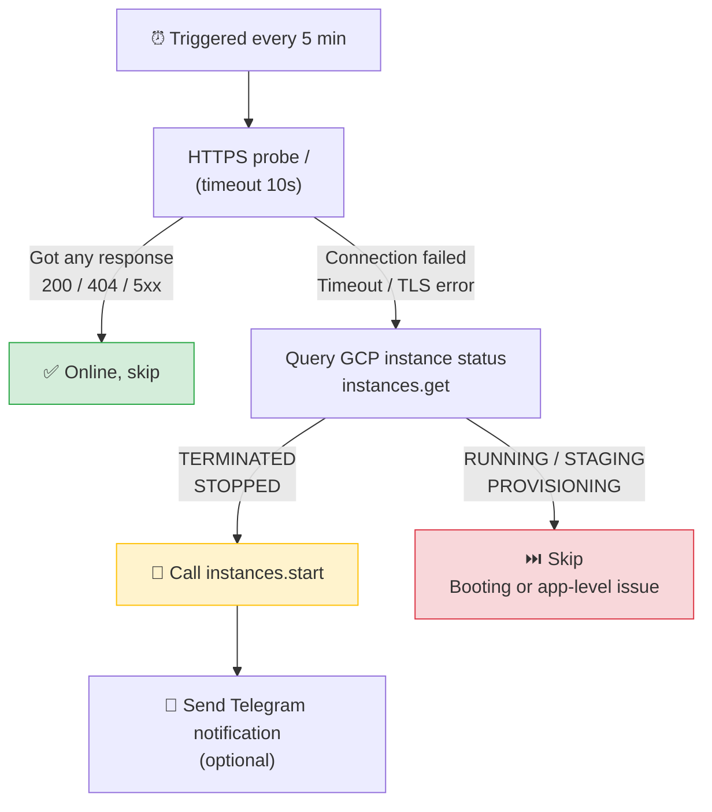

# GCP Spot Watchdog

> Automatically monitor GCP Spot instances and restart them when preempted, with optional Telegram notifications.

[](LICENSE)
[](#)
[](#)

[中文文档](README.md)

---

## Why?

GCP **Spot (preemptible) instances** offer 60-91% discounts over on-demand pricing, but can be reclaimed by Google at any time — your VM gets `TERMINATED` with little notice. For fault-tolerant workloads, Spot is a great deal — as long as you can **automatically restart** instances after preemption.

**GCP Spot Watchdog** is that auto-restarter.

## How It Works



**Key design**: we don't blindly restart on probe failure. The GCP instance status acts as a **gate** — `instances.start` is only called when the instance is confirmed `TERMINATED`/`STOPPED`. This prevents duplicate start calls on booting instances and distinguishes "preempted" from "VM is running but the app crashed."

## Two Deployment Options

Two **fully independent** options — pick whichever fits your setup:

| | Option A: Debian Watchdog | Option B: Cloudflare Worker |
|:--|:--|:--|
| **Runtime** | An always-on Linux machine | Cloudflare serverless |
| **Stack** | Bash + gcloud CLI + systemd timer | JavaScript + Cron Trigger |
| **Probe** | `curl` | `fetch()` |
| **GCP Auth** | `gcloud` service account activation | RS256 JWT → OAuth token in JS |
| **Requires always-on machine** | Yes | **No** |
| **Best for** | Existing server / internal probing | Zero-maintenance / free tier |

## Quick Start

### Prerequisites

- A GCP project with Spot instances running
- Monitored instances must have a **publicly reachable HTTPS service** (firewall rule allowing the port)
- [gcloud CLI](https://cloud.google.com/sdk/docs/install) installed and authenticated with IAM admin permissions

### Step 1: GCP Service Account Setup (shared by both options)

`setup-gcp.sh` creates a least-privilege service account (only `compute.instances.get` / `start` / `list`) and downloads the key file.

> **💡 Recommended: use GCP Cloud Shell**
>
> Open the [GCP Console](https://console.cloud.google.com) and click the **`>_`** icon in the top-right corner to launch Cloud Shell.
> It comes with `gcloud` pre-installed and already authenticated — no local setup needed. After running the script, use `cloudshell download sa-key.json` to download the key to your local machine.

<details>
<summary>Using Cloud Shell</summary>

```bash
# 1. Clone the repo (or paste the script content in the Cloud Shell editor)
git clone https://github.com/your-username/GCP_Start.git
cd GCP_Start

# 2. Edit PROJECT_ID
nano setup-gcp.sh

# 3. Run
bash setup-gcp.sh

# 4. Download the key file to your local machine
cloudshell download sa-key.json
```

</details>

<details>
<summary>Using a local terminal</summary>

```bash
# Requires gcloud CLI installed and authenticated:
# https://cloud.google.com/sdk/docs/install
gcloud auth login

git clone https://github.com/your-username/GCP_Start.git
cd GCP_Start

# Edit PROJECT_ID at the top of the script
nano setup-gcp.sh

bash setup-gcp.sh
```

</details>

This produces `sa-key.json` and prints the service account email. **Keep this file safe — it is git-ignored and must never be committed.**

---

### Step 2 (Option A): Debian Watchdog

> For when you already have an always-on Debian/Ubuntu machine.

#### 2A-1. Install dependencies

```bash
sudo apt-get update && sudo apt-get install -y curl

# Install gcloud CLI per official docs:
# https://cloud.google.com/sdk/docs/install#deb
```

#### 2A-2. Configure target instances

Edit `spot-watchdog/targets.conf` — one instance per line:

```conf
# project            zone              instance      health_url
my-project           us-central1-a     web-1         https://web1.example.com/
my-project           asia-east1-b      worker-1      https://worker1.example.com/
```

> The health URL is considered "alive" if it returns **any HTTP response** (200, 404, 500 all count). Only connection failure/timeout/TLS errors are treated as "down."

#### 2A-3. Install to system

```bash
sudo mkdir -p /opt/spot-watchdog
sudo cp spot-watchdog/watchdog.sh spot-watchdog/targets.conf sa-key.json /opt/spot-watchdog/
sudo chmod 600 /opt/spot-watchdog/sa-key.json
sudo chmod +x /opt/spot-watchdog/watchdog.sh
sudo cp spot-watchdog/spot-watchdog.service spot-watchdog/spot-watchdog.timer /etc/systemd/system/
sudo systemctl daemon-reload
sudo systemctl enable --now spot-watchdog.timer
```

#### 2A-4. (Optional) Enable Telegram notifications

Edit `/etc/systemd/system/spot-watchdog.service`, uncomment and fill in:

```ini
Environment=TG_BOT_TOKEN=your_bot_token
Environment=TG_CHAT_ID=your_chat_id
```

Then reload:

```bash
sudo systemctl daemon-reload
```

#### 2A-5. Verify

```bash
# Trigger manually
sudo systemctl start spot-watchdog.service

# Watch logs
journalctl -u spot-watchdog.service -f

# Check next scheduled run
systemctl list-timers spot-watchdog.timer
```

<details>
<summary>Environment variables</summary>

| Variable | Default | Description |
|:--|:--|:--|
| `GCP_SA_KEY` | `<script-dir>/sa-key.json` | Path to service account key |
| `WATCHDOG_CONF` | `<script-dir>/targets.conf` | Path to target list |
| `PROBE_TIMEOUT` | `10` | HTTP probe timeout (seconds) |
| `TG_BOT_TOKEN` | — | Telegram bot token |
| `TG_CHAT_ID` | — | Telegram chat id |

</details>

---

### Step 2 (Option B): Cloudflare Worker

> No always-on machine needed. Covered by the free tier.

#### 2B-1. Install dependencies and log in

```bash
cd spot-watchdog-worker
npm install
npx wrangler login    # Opens Cloudflare auth page in browser
```

#### 2B-2. Configure target instances

Edit `TARGETS` in `wrangler.toml`:

```toml
TARGETS = '''[
  {"project":"my-project","zone":"us-central1-a","instance":"web-1","healthUrl":"https://web1.example.com/"},
  {"project":"my-project","zone":"asia-east1-b","instance":"worker-1","healthUrl":"https://worker1.example.com/"}
]'''
```

#### 2B-3. Set secrets

```bash
# Service account email (printed by setup-gcp.sh)
npx wrangler secret put GCP_SA_EMAIL

# Private key from sa-key.json
npx wrangler secret put GCP_SA_PRIVATE_KEY
```

> **PowerShell**: `(Get-Content sa-key.json | ConvertFrom-Json).private_key`
>
> **Bash/Linux**: `jq -r .private_key sa-key.json`

#### 2B-4. (Optional) Enable Telegram notifications

```bash
npx wrangler secret put TG_BOT_TOKEN
npx wrangler secret put TG_CHAT_ID
```

#### 2B-5. Deploy

```bash
npx wrangler deploy
```

The Cron Trigger runs automatically every 5 minutes.

#### 2B-6. Verify

```bash
# Local dev testing
npx wrangler dev
# Trigger a round from another terminal
curl http://localhost:8787/run

# Watch production logs
npx wrangler tail
```

<details>
<summary>Environment variables / Secrets</summary>

| Name | Type | Description |
|:--|:--|:--|
| `TARGETS` | var | JSON array of target instances |
| `PROBE_TIMEOUT_MS` | var | HTTP probe timeout in ms (default 10000) |
| `GCP_SA_EMAIL` | secret | Service account email |
| `GCP_SA_PRIVATE_KEY` | secret | Service account private key (PEM) |
| `TG_BOT_TOKEN` | secret | Telegram bot token (optional) |
| `TG_CHAT_ID` | secret | Telegram chat id (optional) |

</details>

---

## Telegram Notifications

Both options support optional Telegram push notifications. Once configured, the following events trigger a message:

| Event | Message |
|:--|:--|
| Instance auto-started | `🔴→🟢 Spot instance auto-started` + instance/project/zone/time |
| Instance start failed | `❗ Spot instance start failed` + instance/project/zone/time |

**Getting your Telegram Bot Token and Chat ID**:

1. Search for **@BotFather** on Telegram → send `/newbot` → follow the prompts to get your bot token
2. Send any message to your new bot
3. Visit `https://api.telegram.org/bot<your-token>/getUpdates` and find `chat.id` in the response
4. Or search for **@userinfobot** to get your chat id directly

## End-to-End Testing

Manually stop an instance to verify automatic restart:

```bash
# 1. Stop a test instance (simulates preemption)
gcloud compute instances stop TEST_INSTANCE --zone=ZONE

# 2. Trigger a check (or wait up to 5 minutes)
#    Option A:
sudo systemctl start spot-watchdog.service
#    Option B (local):
curl http://localhost:8787/run

# 3. Expected result:
#    - Logs show: DOWN → START ... TERMINATED -> starting
#    - GCP Console: instance goes from TERMINATED → STAGING → RUNNING
#    - (If configured) Telegram notification received
```

## Project Structure

```
GCP_Start/
├── README.md                            # Chinese documentation
├── README_EN.md                         # This file
├── setup-gcp.sh                         # One-time GCP service account setup
├── .gitignore
├── .gitattributes
│
├── spot-watchdog/                       # Option A: Debian watchdog
│   ├── watchdog.sh                      #   Main script
│   ├── targets.conf                     #   Target instance list
│   ├── spot-watchdog.service            #   systemd oneshot unit
│   ├── spot-watchdog.timer              #   systemd timer (every 5 min)
│   └── README.md
│
└── spot-watchdog-worker/                # Option B: Cloudflare Worker
    ├── wrangler.toml                    #   Worker config + Cron Trigger
    ├── src/index.js                     #   All logic (probe/auth/start/notify)
    ├── package.json
    └── README.md
```

## Adjusting Probe Interval

The default probe interval is **5 minutes**. To change it:

- **Option A**: Edit `OnUnitActiveSec=5min` in `spot-watchdog.timer`, then `systemctl daemon-reload && systemctl restart spot-watchdog.timer`
- **Option B**: Edit `crons = ["*/5 * * * *"]` in `wrangler.toml`, then `npx wrangler deploy`

## Security

- `sa-key.json` is in `.gitignore` — **never committed**
- The service account has least-privilege permissions: only `compute.instances.get` / `start` / `list`
- Worker secrets are encrypted at rest via Wrangler Secrets — they never appear in code or config files

## License

[MIT](LICENSE)
